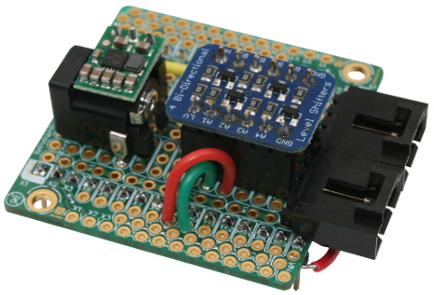
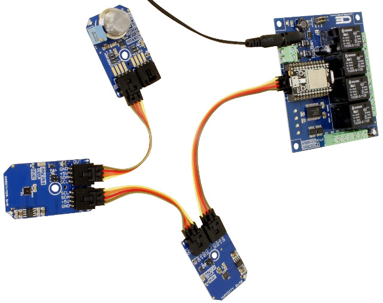
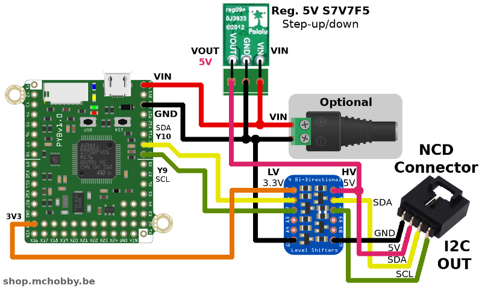

[Ce fichier existe également en FRANCAIS ici](readme.md)

# NCD Connector on Pyboard

Here a wiring proposal (with PinOut) to connect NCD boards on a Pyboard.



# What's about the NCD  / National Control Device ecosystem?

([National Control Device](https://store.ncd.io)) did created a lot of I2C sensors boards (namely "_I2C Mini Board_") using a standardized 4 pins connector shipping __5V power supply__ and __5V logic I2C bus__.


Using this standard NCD interface on a __wide variety of boards__ (as Arduino, Raspberry, Feather, WiPy, LoPy, etc) and sensor boards is absolutely fabulous! This ease the prototyping and custom solution without the hardness of advanced electronic skill or the soldering skill (NCD also maintain a GitHub with Arduino, C, Python, ... codes).



# NCD Connector
To connect a NCD mini I2C board, you will need a NCD connector (I2C output connector) and connexion wiring.


NCD already have many adapter board [available here](https://store.ncd.io/shop/?fwp_product_type=adapters) but we can also create our own wiring for other development board (as show here under).

# Wiring


Wiring with DC/DC regulator used to produce 5V from any VIn voltage.
As we suggest a step-up and step-down S7V7F5 regulator, it is possible to use a wide variety of supply source  (like USB, battery pack, Lipo).


__Note 1:__ When powered from Pyboard's USB, the Vin voltage is set to 4.40V (VUSB - Shottky Protection Diode). The voltage is step-up tp 5V by the regulator.

__Note 2:__ You can also supply Vin directly with 5V. In such can, the regulator can be replace with bridge Vin-->Vout (instead of the regulator).

# I2C bus
The following instruction shows how to create an instance of I2C bus on the NCD connector.

```
from machine import I2C

i2c = I2C(2)
```

# Where to find the MicroPython driver for your NCD board

All our MicroPython drivers are stored on the [pyboard-driver](https://github.com/mchobby/pyboard-driver)  GitHub AND [esp8266-upy](https://github.com/mchobby/esp8266-upy) GitHub. The MicroPython drivers running on ESP8266 under MicroPython will also run on the Pyboard :-)

The MicroPython driver for the board exposing a NCD connector are stored inside folders starting their name with "__ncd-__" (eg: ncd-si7005, ncd-mpl115-a2, etc).

# Shopping list
* [Pyboard prototyping board](https://shop.mchobby.be/fr/micropython/598-plaque-de-prototypage-pour-pyboard-3232100005983.html)
* NCD male connector: [available on NCD.io](https://store.ncd.io/product/i2c-interface-cable-connector-4-pin-male-molex-0705530003-wm4902-nd/)
* NCD I2C mini board: [wide range of board available at ncd.io](https://ncd.io/).
* [MicroPython Pyboard](https://shop.mchobby.be/fr/56-micropython)
