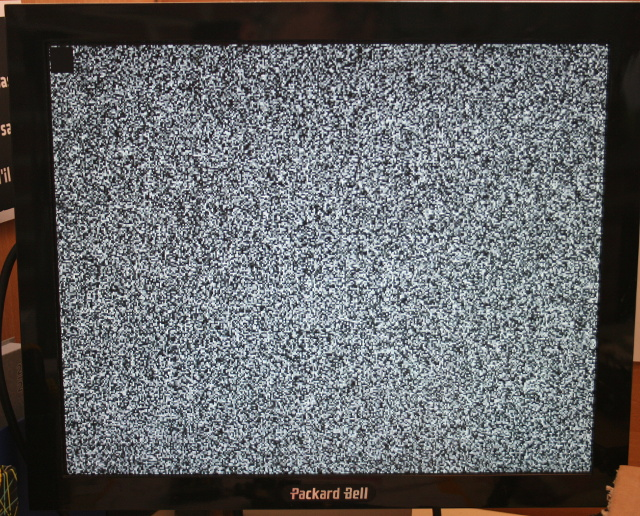

[This file also exists here in ENGLISH](README_eng.md)

* bitmap : dessiner un triangle qui bouge. Tracé pixel par Pixel.
* snow : utiliser du MicroCode sur le co-processeur pour simuler la neige sur l'écran.

# Exemple Bitmap
L'exemple bitmap se penche sur la manipulation d'image constituée de points (Bitmap).
Il utilise un triangle, dont les coins se déplacent, pour traiter le sujet.


## Tester le script

Démarrez une session REPL puis saisissez

```
import bitmap
```

# Exemple snow
Cet exemple simule un écran neigeux à l'aide du co-processeur graphique et du microcode.



## Tester le script

Démarrez une session REPL puis saisissez

```
import snow
```

# Exemple Wireframe

Cet exemple affiche une animation wireframe sur l'écran (rotation de 29 vaisseau
	spaciaux). Il utilise du micro-code sur le coprocesseur pour accélérer
	l'affichage WireFrame.

Ce script n'inclus pas les ressources à l'intérieur du script Python mais, à
la place, LES CHARGES DIRECTEMENT DEPUIS LES FICHIERS .h parsé à la volée!  


## Tester le script

Pour utiliser cet exemple, il est nécessaire de copier les fichiers suivant sur la Pyboard parce qu'ils seront tous chargés!
* __wiref.py__ : Le script principal utilisé pour tester la fonctionnalité Wirefame.
* __dg.py__ : la bibliothèque gameduino
* __gdtls.py__ : la bibliothèque outil pour gameduino (contient la classe __HLoader__ utilisé pour __parser des fichiers .h__ au vol)
* __eliteships.h__ : la liste des vaisseau spaciaux, definition des vertices et edges.
* __eraser.h__ : microcode de l'effacage d'écran.
* __wireframe.h__ : microcode wireframe chargé avec gd.microcode()

Démarrez  the REPL session et saisir la commande:

```
import wiref
```
