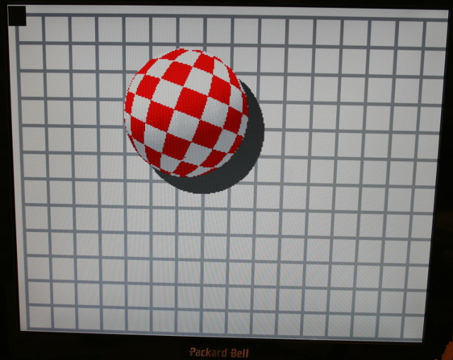

[Ce fichier existe également en FRANCAIS ici](README.md)

* ascii : allows to draw text (8x8 pixels font) on a 36 lines x 47 columns screen.
* ascii-fast : idem ascii but with quite faster initialisation
* ball : a 3D bouncing ball (bouncing on the monitor wall)
* cp437 : allows to draw text (16x8 pixels font, heigth x width) on a 18 lines x 47 columns screen.

# ASCII samples

Those examples mainly concerns the display of texte on the screen. This was the primarily result expected by using the MOD-VGA board with the Pyboard.

## ascii/ascii.py
Explains how to use the ASCII capability of the MODVGA to write text on the screen.

The code is pretty simple.


## ascii/bug.py


## ascii/dump.py
Dump the content of the RAM_CHR where are stored the characters definition (also
	8x8 pixels blocs when drawing game scene)

Here is a part of the output displayed in the REPL session.
```
--( 48)--------------------
4864 : 0b....11111111....
4866 : 0b..1111....1111..
4868 : 0b..1111..111111..
4870 : 0b..111111111111..
4872 : 0b..111111..1111..
4874 : 0b..1111....1111..
4876 : 0b....11111111....
4878 : 0b................
--( 49)--------------------
4880 : 0b......1111......
4882 : 0b....111111......
4884 : 0b......1111......
4886 : 0b......1111......
4888 : 0b......1111......
4890 : 0b......1111......
4892 : 0b..111111111111..
4894 : 0b................
--( 50)--------------------
4896 : 0b....11111111....
4898 : 0b..1111....1111..
4900 : 0b..........1111..
4902 : 0b........1111....
4904 : 0b......1111......
4906 : 0b....1111........
4908 : 0b..111111111111..
4910 : 0b................
--( 51)--------------------
4912 : 0b....11111111....
4914 : 0b..1111....1111..
4916 : 0b..........1111..
4918 : 0b......111111....
4920 : 0b..........1111..
4922 : 0b..1111....1111..
4924 : 0b....11111111....
4926 : 0b................
```

# ASCII-FAST sample

The `ascii-fast/asciif.py` use the .bin file technics (explained in "sprite256" demo) to reload the state of RAM_CHR, RAM_PAL, RAM_PIC with the preloaded
ascii setup. This approach is quite faster consume less memory than calling `gd.ascii()` .

This version only need the 3 binary files on the Pyboard (namely chr.bin, ram_pal.bin, ram_pic.bin).

## How did I created the bin files?

Quite simple:
1. I removed all the putstr() call from the ascii.py example and then I ran it.
2. At this stage the screen is black with all the RAM stuff properly initialized.
3. I used the `ramtoh.py` (in the /00_basic/) to dump the RAM_CHR, RAM_PAL, RAM_PIC state to REPL session (as header file format)
4. I copied the generated header to a real file (namely ascii-fast.h , UTF-8)
5. Finally I did compiled the header file with the `htobin.py` utility (also in the /00_basic/) to extract the bin files.

Voila!

Note: It may be possible to extract directly the RAM to a local bin file on the pyboard... but it is best to see and/or manipulate the content of the RAM as needed.  

# Ball sample

The `ball/ball.py` use the .bin files loading technics (for 3 files) to load the background. The ball sprites are compressed in the `ball.bin` which is uncompressed directly from file with the `GDFileBits` class. The `uncompress()` Gameduino's function can detect the difference between the .bin file and bytes() ressource and automagically selects the appropriate decompression `GDFlashBits` or `GDFileBits` class.



See also [the YouTube vidéo](https://youtu.be/J0ZjHtXvZoI)

# Chessboard sample

The `chessboard/chess.py` script simulate a chessboard gameplay and moves pieces on the chessboard.
This script also use the .bin file technic to load the various ressources and display the items.

Please, note that the `Wood32_pic.bin` file is maintained open and used bu the `square()` function to draw the wood squares (brown and white) on the screen by drawing the texture at various place on the screen.


# CodePage samples

## cp437/cp437.py
Explains how to use a custom cp437 code page font (16 x 8 pixels) with the MODVGA to write text on the screen.

As it is a different approach to store characters (indeed, ascii use 8x8 pixels), the cp437.py sample expose two distinct method for text drawing: `drawstr()` & `atxy()`.


