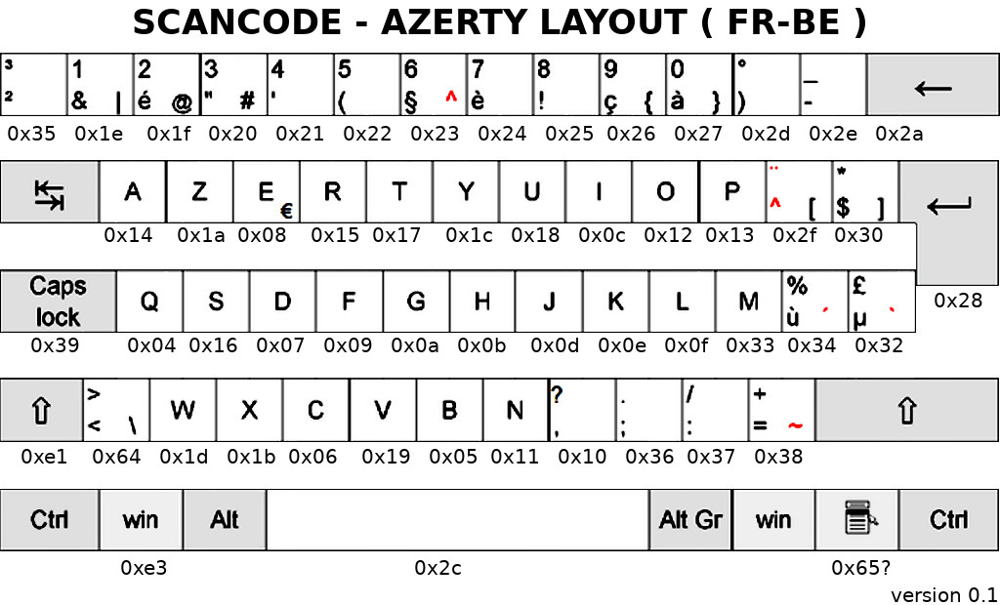

[C fichier existe également en FRANCAIS](readme.md)

# Use a Pyboard as a mouse / keyboard (HID device)

This section of the repository contains examples and libraries to ease the usage of the Pyboard as a HID device (mostly the keyboard device).

Please, remember to activate the HID mode inside the `boot.py` file.

``` python
import machine
import pyb
#pyb.main('main.py') # main script to run after this one

# act as a serial device and a keyboard
pyb.usb_mode('VCP+HID', hid=pyb.hid_keyboard)
```

You can also use the `pyb.hid_mouse` constant (default value for `usb_mode()`).

# keyboard = ScanCode
Using the keyboard relies on Keyboard HID reports. Those reports uses ScanCode to identify the position of the pressed key on the keyboard.



# Library

Using the library rely on 2 distincts tool :
* `usbhid.py` : contains utility functions. They receives the hid device as paramter and well as the KeyMapping.
* `kmap_frbe.py` : contains the KeyMapping declaration, which associate ScanCodes to the corresponding letter on the physical keyboard. The KeyMapping is contained within a dictionnary always named `kmap`. The `kmap_frbe.py` file, contains the `kmap` dictionnary for the AZERTY (fr) having the specific belgian layout (be). We would need to create a file `kmap_frfr.py` for an AZERTY French layout.

# Examples

The `examples` folder contains very instructive examples. Please read them to understand how to use this library set.

# Ressources
* http://wiki.micropython.org/USB-HID-Keyboard-mode-example-a-password-dongle
