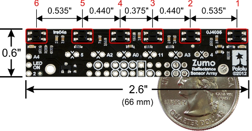

[This file also exists in ENGLISH here](readme_ENG.md)

# ROBOT ZUMO V1.2 sous MicroPython avec la Pyboard originale

Ce portage MicroPython concerne le [Robot Zumo de Pololu](https://www.pololu.com/product/2510). Ce robot peut être acheté en pièce détachées ou en version pré-assemblé (comme sur la photo). Ce robot est conçu pour un carte Arduino Uno __MAIS NOUS ALLONS LE FAIRE FONCTIONNER avec une carte MicroPython Pyboard__.

Le Zumo robot est composé d'un châssis, deux moteurs, un shield pour Arduino, une lame en acier inoxydable de 0,9mm d'épaisseur montée à l'avant du châssis lui permettant ainsi de pousser les objets et adversaires aux alentours, d'une matrice de capteurs infrarouge spécialement conçue pour le suivi de lignes.

Vous pouvez consulter les liens suivants pour plus de détails à propos du robot Zumo: [Robot Zumo @ MCHOBBY](https://shop.mchobby.be/fr/prototypage-robotique-roue/448-robot-zumo-pour-arduino-assemble-moteurs-3232100004481-pololu.html) ou [Robot Zumo @ Pololu](https://www.pololu.com/product/2510)

Ce robot Zumo est initialement programmé à l'aide d'un Arduino Uno ou d'un Arduino Leonardo.
Dans ce projet le robot Zumo est programmé grâce à un [adaptateur Pyboard vers UNO-R3](https://github.com/mchobby/pyboard-driver/tree/master/UNO-R3).

Toutes les bibliothèques et exemples en Arduino fournis par [Pololu](https://www.pololu.com) ont été portés sous Micropython.

# Brancher

## Adaptateur Pyboard-UNO-R3

Brancher l'adaptateur [PYBOARD-UNO-R3](https://shop.mchobby.be/fr/nouveaute/1745-adaptateur-pyboard-vers-uno-r3-extra-3232100017450.html) avec la Pyboard sur le Robot Zumo pour Arduino. Utiliser des stacking header facilitera le branchement.

Cet adaptateur est documenté dans le projet [PYBOARD-UNO-R3](https://github.com/mchobby/pyboard-driver/tree/master/UNO-R3). Les bibliothèque PYBOARD-UNO-R3 ne sont pas nécessaires pour ce projet.

## Connexion DIY
Vous pouvez aussi réaliser les connexions Pyboard --> UNO-R3 comme visible en début de cette documentation. Ce n'est pas très beau mais pleinement fonctionnel.

Avec raccordement DIY, vous aurez besoin d'utiliser un [régulateur 5V S7V7F5 de Pololu](https://www.pololu.com/product/2119) pour générer 5V à partir de la tension VIN obtenue depuis les piles du shield Zumo robot. Suivez ce [schéma de distribution d'alimentation](https://github.com/mchobby/pyboard-driver/blob/master/UNO-R3/docs/_static/power-distribution.jpg) repris du projet PYBOARD-UNO-R3. La carte PYBOARD-UNO-R3 dispose, elle, de son propre convertisseur de type buck.

Voyez les schémas DIY du projet [PYBOARD-UNO-R3](https://github.com/mchobby/pyboard-driver/tree/master/UNO-R3) pour les raccordements broches-pyboard vers broches-arduino.

# Tester

## BorderDetect

L'exemple [borderdetect.py](examples/borderdetect.py) est un programme ou le robot Zumo ne sors jamais d'un ring. Le ring est une surface blanche un contour noir.

Le capteur infrarouge détecte la différence de couleurs à l'aide de la bibliothèque [qtrsensors.py](lib/qtrsensors.py). Le noir est peu réfléchissant et le blanc est fortement réfléchissant. En fonction de ces informations les moteurs vont avancer, reculer ou tourner.

"VIDEO ZUMO ET RING"

## LineFollower

Comme son nom l'indique le robot Zumo suit un ligne. Dans cet exemple la ligne est noir. La ligne peut être droite comme courbée.
Grâce aux classes [QTRsensors](https://github.com/mchobby/pyboard-driver/tree/master/Zumo-Robot/lib/qtrsensors.py) et [ZumoMotor](https://github.com/mchobby/pyboard-driver/tree/master/Zumo-Robot/lib/zumoshield.py) le robot Zumo garde une bonne trajectoire.

Voir cette [vidéo réalisée à la Maker Faire Paris 2019](https://youtu.be/VHN83aYCH8Q) (YouTube)

## Compass

L'exemple Compass (Boussole) fait tourner le robot Zumo en carré. Grâce au magnétomètre du LSM303 le robot Zumo tourne 4 fois de 90 degrés à l'aide du champ magnétique terrestre.

[VIDEO COMPASS]

# Bibliothèques

## Classe QTRSensors

La bibliothèque [qtrsensors.py](lib/qtrsensors.py) propose la classe `QTRSensors` qui sert à lire les informations du [capteur de réflectance](https://www.pololu.com/product/1419/) et permet au robot Zumo de distinguer une ligne noire sur fond blanc (ou inversément).

Le [Capteur de réflectance](https://www.pololu.com/product/1419/) existe en plusieurs exemplaires de 1 à 31 capteurs infrarouge. Le Zumo Robot en utilise seulement 6.

## Classe ZumoBuzzer

Le buzzer présent le shield du robot Zumo est prit en charge par la bibliothèque [zumobuzzer.py](lib/zumobuzzer.py). C'est un buzzer passif capable de produire différents son en faisant varier le signal PWM qui le fait osciller.

Cette bibliothèque permet de produire des notes sur plusieurs octaves (ainsi que la durée des sons). Une mélodie peut être saisie dans une chaîne de caractère et être décodée par la bibliothèque.

## Bibliothèque zumoshield

La bibliothèque [zumoshield.py](lib/zumoshield.py) contient les classes `ZumoMotor` et  `ZumoReflectanceSensorArray` permettant de prendre rapidement le contrôle des moteurs [moteurs 75:1 du Zumo](https://shop.mchobby.be/fr/moteurs-continu/431-micro-moteur-751-hp-axe-3mm-d-engrenage-metal-3232100004313-pololu.html) et du [suiveur de ligne](https://www.pololu.com/product/1419/) présent sur le Robot Zumo.

## Classe Pushbutton

La bibliothèque [pushbutton.py](lib/pushbutton.py) défini la classe `Pushbutton` permettant de détecter l'état enfoncé ou relâché d'un bouton.

## Classe L3GD20_I2C

La bibliothèque [L3G.py](lib/L3G.py) contient la classe L3GD20_I2C prenant en charge le Gyroscope L3GD20H intégré au Zumo Robot.
L3GD20H est un gyroscope de type MEMS (Microelectromechanical systems) qui permet de calculer la vitesse angulaire en degrés/secondes.

## LSM303
Le capteur LSM303 est un magnétomètre et accéléromètre. Il se trouve sur le shield du robot Zumo. Il communique en I2C, pour plus d'information rediriger vous vers le [github du capteur LSM303.](https://github.com/mchobby/esp8266-upy/tree/master/lsm303)

# Materiel
* [Adaptateur Pyboard-UNO-R3](https://github.com/mchobby/pyboard-driver/tree/master/UNO-R3) @ MCHobby (permet de connecter une Pyboard sur des shields Arduino)
* [Robot Zumo assemblé](https://shop.mchobby.be/fr/prototypage-robotique-roue/448-robot-zumo-pour-arduino-assemble-moteurs-3232100004481-pololu.html?search_query=zumo&results=5) @ MC Hobby

## Robot Zumo Pièces:          
* [Chassis sans moteurs](https://shop.mchobby.be/fr/prototypage-robotique-roue/447-zumo-kit-chassis-sans-moteur-3232100004474-pololu.html?search_query=zumo&results=5) @ MC Hobby
* [Kit chenille](https://shop.mchobby.be/fr/prototypage-robotique-roue/435-kit-chenille-85mm-entre-axe-3232100004351-pololu.html?search_query=zumo&results=5) @ MC Hobby
* [Micro motor 75:1](https://shop.mchobby.be/fr/moteurs-continu/431-micro-moteur-751-hp-axe-3mm-d-engrenage-metal-3232100004313-pololu.html?search_query=75%3A1&results=6)  @ MC Hobby
* [Zumo Shield](https://www.pololu.com/product/2508) @ Pololu
* [Zumo Blade](https://www.pololu.com/product/1410) @ Pololu
* [Zumo Reflectance Sensor Array](https://www.pololu.com/product/1419/) @ Pololu
