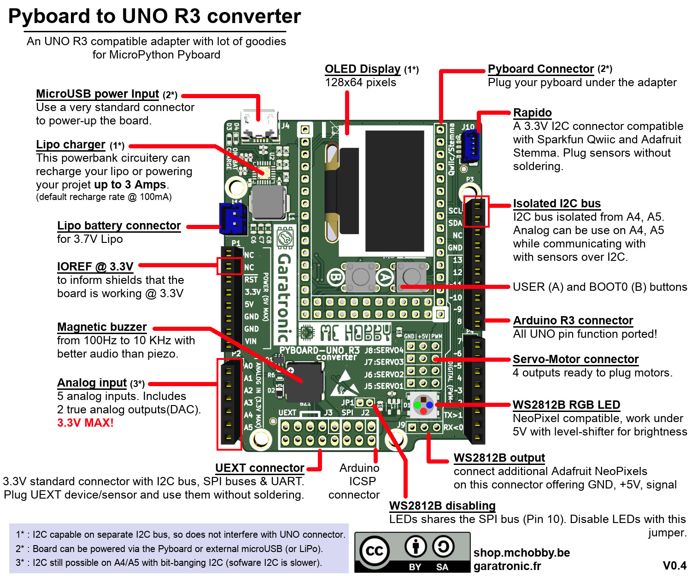
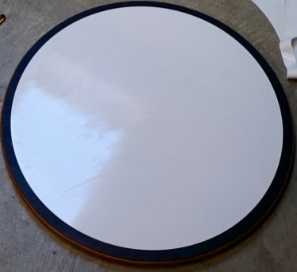
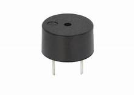

# ROBOT ZUMO V1.2 under MicroPython with the Pyboard original

This MicroPython portage is about the [Zumo Robot from Pololu](https://www.pololu.com/product/2510). That robot can be assembled from various parts or you can be purchased fully assembled (like shown on the picture). This robot is designed for Arduino Uno board __BUT WE WILL MAKE IT RUNNING with a MicroPython Pyboard__.

The Zumo robot is composed of a chassis, two DC motor, a shield interface for Arduino, a front blade used to push objects or others robots in the neighbour and and infrared reflectance sensor array used to follow lines.

For more détails about the Zumo robot, you can browse the [Zumo Robot page @ MCHobby](https://shop.mchobby.be/fr/prototypage-robotique-roue/448-robot-zumo-pour-arduino-assemble-moteurs-3232100004481-pololu.html) or the [Zumo Robot @ Pololu](https://www.pololu.com/product/2510)

Initialy, this robot is designed for Arduino Uno / Leonardo board. With this project the Zumo Robot will be scripted in Python with the help of [Pyboard vers UNO-R3 adapter](https://github.com/mchobby/pyboard-driver/tree/master/UNO-R3).

All the library and examples made by [Pololu](https://www.pololu.com/) have been ported to  Micropython.

# Wiring

## Pyboard-UNO-R3 Adapter

Plug the [PYBOARD-UNO-R3 pyboard](https://shop.mchobby.be/fr/nouveaute/1745-adaptateur-pyboard-vers-uno-r3-extra-3232100017450.html) with the Pyboard on the Zumo Robot for Arduino. Using staking header may help.

This adapter is documented in the [PYBOARD-UNO-R3](https://github.com/mchobby/pyboard-driver/tree/master/UNO-R3) project. The PYBOARD-UNO-R3 libraries will not be used in this project.

## DIY Connection
You can also make the various connections between the Pyboard <--> UNO-R3 as show in the beginning of this documentation. It is not the most beautiful assembly but this is fully functional.

See the DIY schematic of the [PYBOARD-UNO-R3](https://github.com/mchobby/pyboard-driver/tree/master/UNO-R3) project.

# Test

## BorderDetect

The [borderdetect.py](examples/borderdetect.py) example is a script driving the Zumo robot and maintaining it inside the ring. The ring is made of a white surface surrounded with a black ring. The infrared sensor under the Zumo detects the color change with the [QTRsensors](lib/qtrsensors.py) library. The black reflect lesser light than white surface (reflecting a lot of light). Depending on the informations collected, the code control the motor to go forward, backward or rotating the robot.

"VIDEO ZUMO in RING"

## LineFollower

As the name suggest it, this script make the Zumo Robot following a black line drawed on the floor.
Thanks to the [QTRsensors](https://github.com/mchobby/pyboard-driver/tree/master/Zumo-Robot/lib/qtrsensors.py) and [ZumoMotor](https://github.com/mchobby/pyboard-driver/tree/master/Zumo-Robot/lib/zumoshield.py) libraries, the Zumo Robot drives along the line.

See [this video made at the Make Faire Paris 2019](https://youtu.be/VHN83aYCH8Q) (Youtube)

## Compass

The Compass example make the Zumo Robot driving a square shape. Thanks to the LSM303 magnetometer and the earth megnetic field, the robot can turn 4 times with an exact angle of 90°.

[VIDEO COMPASS]

# Libraires

## QTRSensors class

The [qtrsensors.py](lib/qtrsensors.py) library contains the `QTRSensors` class used to read the [reflectance sensor array](https://www.pololu.com/product/1419/). Thanks to this sensor, the Zumo robot can make the difference between white and dark/black part.

The [reflectance sensor array](https://www.pololu.com/product/1419/) exists in many flavour with 1 to 31 cells. The Zumo Robot use 6 cells.

## ZumoBuzzer class

The buzzer on the Zumo Robot shield is handled by the [zumobuzzer.py](lib/zumobuzzer.py) library. This buzzer can produce various sounds and note by using PWM signal.

This library can produce notes over several octaves and can manage note length. Melody can be stored within an string and the the library will decode and play it on the Buzzerr.

## zumoshield library

The [zumoshield.py](lib/zumoshield.py) library contains the `ZumoMotor` and  `ZumoReflectanceSensorArray` classes used to quickly take the control the [75:1 Zumo motors](https://shop.mchobby.be/fr/moteurs-continu/431-micro-moteur-751-hp-axe-3mm-d-engrenage-metal-3232100004313-pololu.html) and the [line follower (reflectance sensor)](https://www.pololu.com/product/1419/) available on the Zumo Robot.

## Pushbutton class

The [pushbutton.py](lib/pushbutton.py) library contains the `Pushbutton` class used to detect the user button state (pressed or released).

## L3GD20_I2C class

The [L3G.py](lib/L3G.py) library and its L3GD20_I2C class is made to handle the L3GD20H gyroscope. L3GD20H use the MEMS technology (Microelectromechanical systems) to calculate angular speed in degrees/secondes.

## LSM303 class
The LSM303 is a magnetometer + accelerometer sensor. This sensor is also present on the Zumo Robot shield. The communication with the sensor is managed through the I2C bus. For mode information about this sensor, please check the [LSM303 driver on GitHub](https://github.com/mchobby/esp8266-upy/tree/master/lsm303)

# Material
* [Pyboard-UNO-R3 adapter](https://github.com/mchobby/pyboard-driver/tree/master/UNO-R3) @ MCHobby (permet de connecter une Pyboard sur des shields Arduino)
* [Assembled Robot Zumo](https://shop.mchobby.be/fr/prototypage-robotique-roue/448-robot-zumo-pour-arduino-assemble-moteurs-3232100004481-pololu.html?search_query=zumo&results=5) @ MC Hobby

## Robot Zumo parts          
* [Zumo chassis (without motors)](https://shop.mchobby.be/fr/prototypage-robotique-roue/447-zumo-kit-chassis-sans-moteur-3232100004474-pololu.html?search_query=zumo&results=5) @ MC Hobby
* [caterpillar kit](https://shop.mchobby.be/fr/prototypage-robotique-roue/435-kit-chenille-85mm-entre-axe-3232100004351-pololu.html?search_query=zumo&results=5) @ MC Hobby
* [75:1 Micro motor](https://shop.mchobby.be/fr/moteurs-continu/431-micro-moteur-751-hp-axe-3mm-d-engrenage-metal-3232100004313-pololu.html?search_query=75%3A1&results=6)  @ MC Hobby
* [Zumo Shield](https://www.pololu.com/product/2508) @ Pololu
* [Zumo Blade](https://www.pololu.com/product/1410) @ Pololu
* [Zumo Reflectance Sensor Array](https://www.pololu.com/product/1419/) @ Pololu
